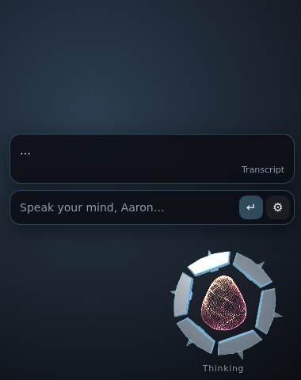

# Ghost

A floating personal AI companion for Windows. Ghost lives in a corner of your screen as an animated shell with a glowing particle eye. You type to it, it answers out loud, and it can act on your PC: open apps, search the web, set reminders, remember things about you, and (with your one-click approval) run commands or change files.

It runs on **your existing subscriptions, not API keys.** Ghost drives the official **Claude Code CLI** (Claude Pro/Max) and Google's **Antigravity CLI** (Gemini on a Google AI Pro plan) in the background, so usage counts against the same plan limits you already have.



## Highlights

- **Subscription-powered brain.** Claude is the primary backend and Gemini the fallback, with automatic model routing: Haiku for quick things, Sonnet by default, Opus when you say "think hard". Conversations continue across messages, and a fresh one starts after 2 hours of quiet.
- **Quick to answer.** Claude stays running between messages instead of starting up for each one, and the voice starts on the reply's opening clause. Replies start with the answer, with no "Certainly, Aaron." first. Settings → Brain can show how long each reply took.
- **Says hello.** On every startup the shards fly in and lock around the eye, and Ghost greets you: by time of day, how long you've been away, the day of the week (or your birthday, if it knows it), never the same line twice in a row.
- **A voice with a Ghost feel.** It uses the ElevenLabs free tier and falls back automatically to free Edge neural voices. A soundalike stock voice goes through an adjustable *Ghost filter* (metallic resonance, shimmer, chorus). No voice cloning.
- **A 3D companion drone.** An original gunmetal drone (Three.js): eight armour shards float magnetically around a machined core, and a lens eye holds a living particle core (adapted from the MIT [Voice Orb](https://github.com/aqualang89/shipnotes-components)) plus a holographic iris.
  - **Speech:** the shards open and close with the voice like a mouth.
  - **Attention:** it follows your cursor anywhere on screen, and a soft beam points from its eye.
  - **Idle life:** it glances around, blinks, calibrates its shards and dozes off after 5 minutes.
  - **Reactions:** a boop when clicked, a happy spin when thanked, a curious tilt on questions and a droop on errors.
  - **Looks:** every state has its own choreography, with five colour themes plus a custom one and a "classic orb" skin.
  - **Performance:** adaptive render quality.
- **Sees your screen when you want it to.** Live screen view (Ctrl+Alt+V, or "watch my screen") attaches a snapshot of the monitor under your cursor to each message, with Ghost left out of the picture and a LIVE tag while it's on. There's an optional auto-off timer. "What's on my screen?" takes a one-off look.
- **Remembers, in Obsidian.** Connect your vault and Ghost's history lives there as notes:
  - **Conversations:** each gets a note with a title, summary, key points and the full transcript (folded), linked from that day's Daily Note.
  - **Links, tags and Properties:** people and topics link to your existing notes, and tags reuse the ones you already have.
  - **Memory notes:** what Ghost knows about you is filed by topic (About me, People, Preferences, Plans & routines). Edit a bullet and Ghost follows.
  - **Your other notes:** Ghost can search and read them, and add to them after you confirm.
  - **Continuity:** conversations survive restarts either way, and without a vault everything stays on your PC as before.
- **Stays out of the way.** Click-through when idle, corner snap or free drag across monitors, size and opacity sliders, auto-hide over fullscreen games (voice and reminders keep working), a `Ctrl+Space` summon hotkey, and start at login.
- **Safe by default.** Opening apps, URLs and documents, searching, reminders and memory run instantly. Running commands, writing, deleting, closing apps, opening programs or scripts, and reading files outside Desktop, Documents, Downloads, the vault and Ghost's own folders show a confirm card (auto-denied after 60 s). The brains' own file tools are switched off or fenced to those folders, so a web page can't trick them into reading private files.
- **Ready for a phone later.** The brain (core) and the UI talk over a token-protected local WebSocket, so a phone client can later speak the same protocol (see `src/shared/protocol.ts`).

## Quick start (Windows)

See **[docs/SETUP.md](docs/SETUP.md)** for the full walkthrough. In short:

```powershell
npm install -g @anthropic-ai/claude-code   # then run `claude` once and log in with your Pro/Max account
irm https://antigravity.google/cli/install.ps1 | iex   # optional Gemini fallback: then run `agy` once and sign in
git clone https://github.com/TengledCode/Ghost; cd Ghost
npm install
npm run dev                                # or: npm run dist:win for an installer
```

## Architecture

```
Electron main ─┬─ Overlay window (transparent, always on top)  ── src/renderer/overlay
               ├─ Settings window                               ── src/renderer/settings
               ├─ Tray · hotkey · login item · fullscreen watcher
               └─ Ghost core (ws://127.0.0.1, token)             ── src/core
                    ├─ providers/  claude · agy (each one live stream-json session)
                    ├─ router · persona · memory · reminders
                    ├─ approvals (confirm-risky policy)
                    ├─ tools/  ← MCP bridge (stdio) launched by the CLI
                    └─ tts/    ElevenLabs → Edge fallback, sentence-streamed
```

Every side effect goes through Ghost's own MCP tools (`src/core/tools`), never the CLIs' built-in shell or write tools, so the approval policy is the same whichever model is answering.

## Development

| Command | What it does |
|---|---|
| `npm run dev` | Run the Electron app with hot reload |
| `npm test` | Unit and integration tests (vitest) |
| `npm run typecheck` | TypeScript |
| `npm run build` | Bundle into `out/` |
| `npm run preview:ui` | Run the overlay in a normal browser against an offline mock core (`GHOST_PREVIEW_TTS=synth` for a stand-in voice that moves the shards) |
| `GHOST_PROVIDER=mock npm run dev` | Full app with the mock brain (no subscription usage) |
| `GHOST_LIVE=1 npx vitest run tests/claude.live.test.ts` | One real Claude round trip through the MCP bridge (after `npm run build`) |

The persona lives in `config/persona.md`. Edit it freely: `{{user}}` and `{{assistant}}` are filled from settings.

## Credits

Voice Orb and Signal Orb by [Ship Notes](https://github.com/aqualang89/shipnotes-components), MIT licensed (`vendor/shipnotes/LICENSE`). The particle core's motion is adapted from the Voice Orb shader (`src/renderer/overlay/shell/particleCore.ts`). The drone model is original and procedural; it is inspired by the companion-drone archetype, not copied from any game asset.
